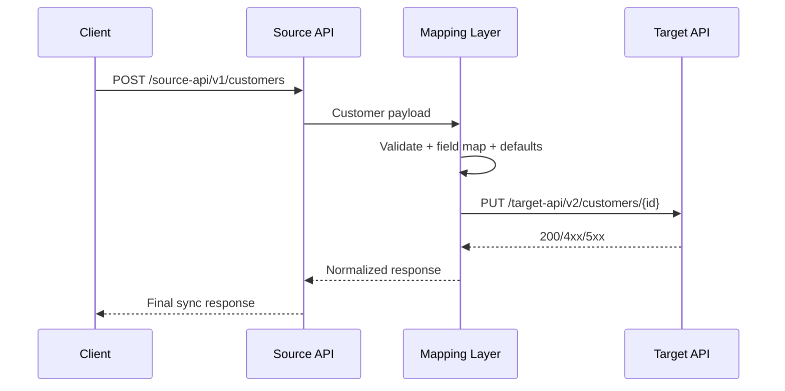
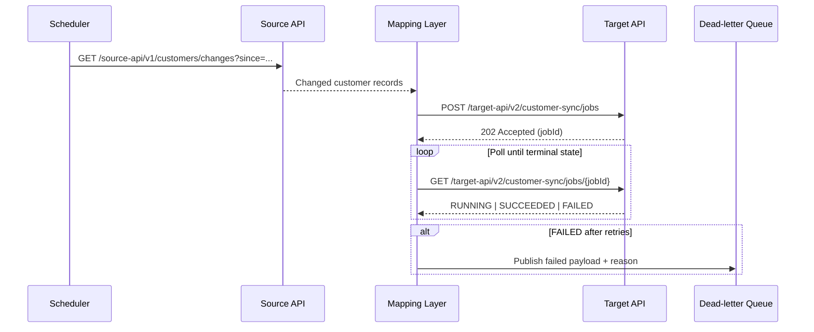

# Data Flow Diagrams

## 1) Synchronous Flow (Request/Response)

```mermaid
sequenceDiagram
    participant C as Client
    participant S as Source API
    participant M as Mapping Layer
    participant T as Target API

    C->>S: POST /source-api/v1/customers
    S->>M: Customer payload
    M->>M: Validate + field map + defaults
    M->>T: PUT /target-api/v2/customers/{id}
    T-->>M: 200/4xx/5xx
    M-->>S: Normalized response
    S-->>C: Final sync response
```

## 2) Asynchronous Bulk Flow (Job-Based)

```mermaid
sequenceDiagram
    participant J as Scheduler
    participant S as Source API
    participant M as Mapping Layer
    participant T as Target API
    participant Q as Dead-letter Queue

    J->>S: GET /source-api/v1/customers/changes?since=...
    S-->>M: Changed customer records
    M->>T: POST /target-api/v2/customer-sync/jobs
    T-->>M: 202 Accepted (jobId)
    loop Poll until terminal state
        M->>T: GET /target-api/v2/customer-sync/jobs/{jobId}
        T-->>M: RUNNING | SUCCEEDED | FAILED
    end
    alt FAILED after retries
        M->>Q: Publish failed payload + reason
    end
```
